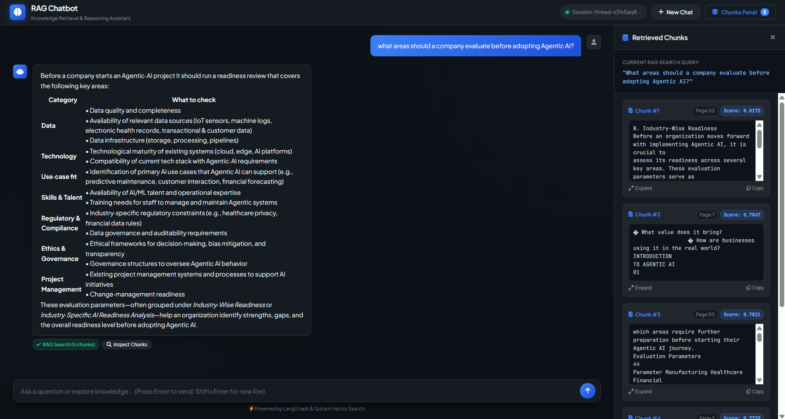
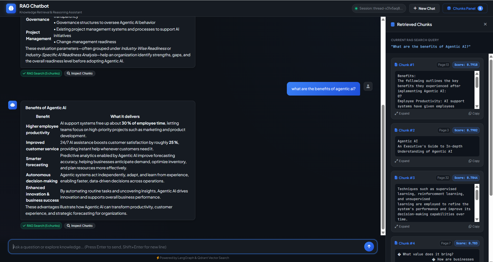
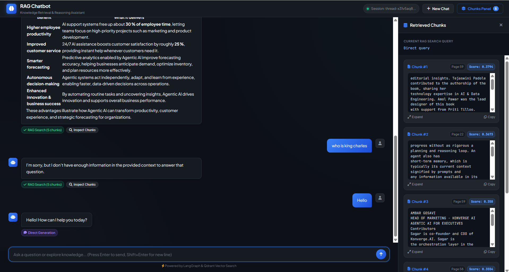
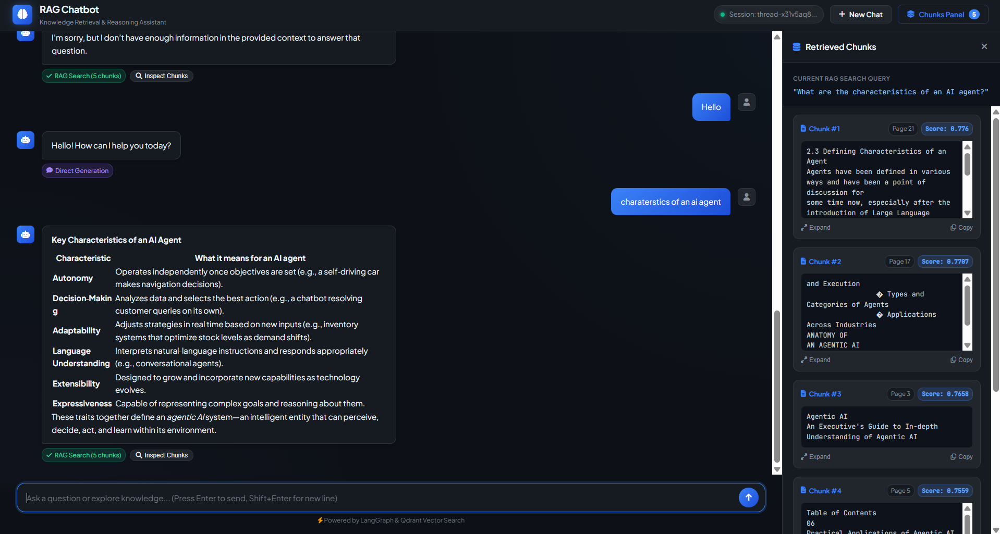
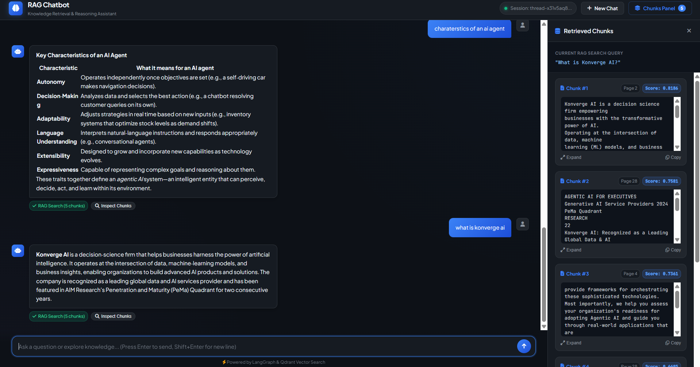

# Agentic RAG Chatbot

An intelligent Retrieval-Augmented Generation (RAG) assistant with conversational memory, dynamic query routing, and multi-provider support.

> **Note**: The core chatbot architecture, graph nodes, query router, vector store integrations, and ingestion pipeline were built from scratch using the official LangChain and LangGraph documentation. The Flask web interface was created with the help of AI.

---

## App Screenshots











---

## Example Queries

Here are some example queries you can ask the chatbot to test document retrieval and reasoning:

- **"What areas should a company evaluate before adopting Agentic AI?"**
- **"What are the benefits of agentic AI?"**
- **"What are the characteristics of an AI agent?"**
- **"What is Konverge AI?"**

---

## Overview and How It Works

Instead of querying the vector database on every single message (like simple greetings or casual conversation), this chatbot uses a LangGraph agent workflow:

```
[User Question]
       │
       ▼
┌──────────────────┐
│   Query Router   │ ──(retrieve = false)──► [Direct Answer Generation] ──► End
└──────────────────┘
       │
  (retrieve = true)
       ▼
┌──────────────────┐
│ Rewrite Query &  │
│ Vector Retrieval │
└──────────────────┘
       │
       ▼
┌──────────────────┐
│ Grounded Answer  │ ──► End
│   Generation     │
└──────────────────┘
```

### Key Workflow Features:
1. **Smart Query Router**: 
   - Uses structured outputs to decide if a query actually requires document retrieval (`retrieve: true/false`).
   - Resolves pronouns and context from conversation history (e.g., rewriting *"tell me more about that"* into *"What is an orchestrator in a multi-agent system?"*).
2. **Context-Grounded Answers**:
   - Only uses retrieved source chunks as ground truth to prevent hallucinations.
3. **Conversational Memory**:
   - Powered by LangGraph's `InMemorySaver` checkpointer using per-session thread IDs.
4. **Flexible LLM & Vector Store Backends**:
   - **LLM Providers**: Google Gemini or Groq.
   - **Vector Stores**: **Qdrant** (local disk/embedded) and **PostgreSQL** (`pgvector`).

## Installation and Setup

You can install dependencies and run this project using either **`uv`** (recommended) or traditional **`pip`**.

### Option A: Using UV (Recommended)

1. **Create and activate virtual environment**:
   ```bash
   uv venv

   # Windows:
   .venv\Scripts\activate
   # macOS / Linux:
   source .venv/bin/activate
   ```

2. **Install locked dependencies**:
   ```bash
   uv sync
   ```

3. **Adding new dependencies**:
   ```bash
   uv add <package-name>
   ```

4. **Running commands directly with UV**:
   ```bash
   uv run python -m chatbot.ui.app
   ```

---

### Option B: Using Pip

1. **Create and activate virtual environment**:
   ```bash
   python -m venv .venv

   # Windows:
   .venv\Scripts\activate
   # macOS / Linux:
   source .venv/bin/activate
   ```

2. **Install dependencies**:
   ```bash
   pip install -r requirements.txt
   ```

3. **Adding new dependencies**:
   ```bash
   pip install <package-name>
   ```

---

## Environment Configuration

Create a `.env` file in the project root by copying `.env.example`:

```bash
cp .env.example .env
```

### Sample `.env` Setup:

```env
# Model Provider ('google' or 'groq')
MODEL_PROVIDER=groq

# Google Gemini API Settings
GOOGLE_API_KEY=your_gemini_api_key_here
GEMINI_MODEL=gemini-3.1-flash-lite

EMBEDDING_PROVIDER=huggingface         # or gemini
HUGGINGFACE_EMBEDDING_MODEL=BAAI/bge-base-en-v1.5
GEMINI_EMBEDDING_MODEL=gemini-embedding-001

# Groq API Settings (if using MODEL_PROVIDER=groq)
GROQ_API_KEY=your_groq_api_key_here
GROQ_MODEL=openai/gpt-oss-20b

# Vector Store Selection ('qdrant' or 'pgvector')
VECTOR_STORE=qdrant
QDRANT_PATH=./qdrant_data

# Optional: PostgreSQL / PGVector (Only needed if VECTOR_STORE=pgvector)
POSTGRES_HOST=localhost
POSTGRES_PORT=5432
POSTGRES_DB=postgres
POSTGRES_USER=postgres
POSTGRES_PASSWORD=postgres

PORT=5000
PROD=false
```

---

## Optional: Starting PostgreSQL for PGVector

If you choose `VECTOR_STORE=pgvector`, you can spin up the PostgreSQL database with `pgvector` pre-configured using Docker:

```bash
# Start only the PostgreSQL vector database
docker compose up -d postgres

# Stop the database
docker compose down
```

---

## Document Ingestion

The ingestion pipeline loads PDFs placed in the `dataset/` directory, chunks them with `RecursiveCharacterTextSplitter`, generates vector embeddings, and stores them in your vector database.

### How to Ingest:
- **Via Web UI**: Open the UI and click the **"Ingest Docs"** button in the top navigation bar (available when `PROD=false`).
- **Via CLI**: Run the ingestion script directly:
  ```bash
  python -m chatbot.rag.ingestion
  ```

### Ingestion Duration:
- Embeddings are sent in batches of up to 90 chunks.
- To stay within free-tier rate limits for embedding APIs, the script waits ~60 seconds between batches.
- A typical document (~100–200 chunks) takes around **2 to 3 minutes** to ingest.
- Once ingested, vectors are stored permanently (in `./qdrant_data` or Postgres) and subsequent searches are instant.

---

## How to Run the Project

### 1. Terminal / CLI Mode
Run the conversational agent directly in your command line:

```bash
python -m chatbot.agent.app
```

---

### 2. Interactive Web UI (Flask)
Start the local web interface to chat with the assistant and inspect retrieved document chunks and similarity scores:

```bash
python -m chatbot.ui.app
```

Then visit **http://127.0.0.1:5000** in your browser.

